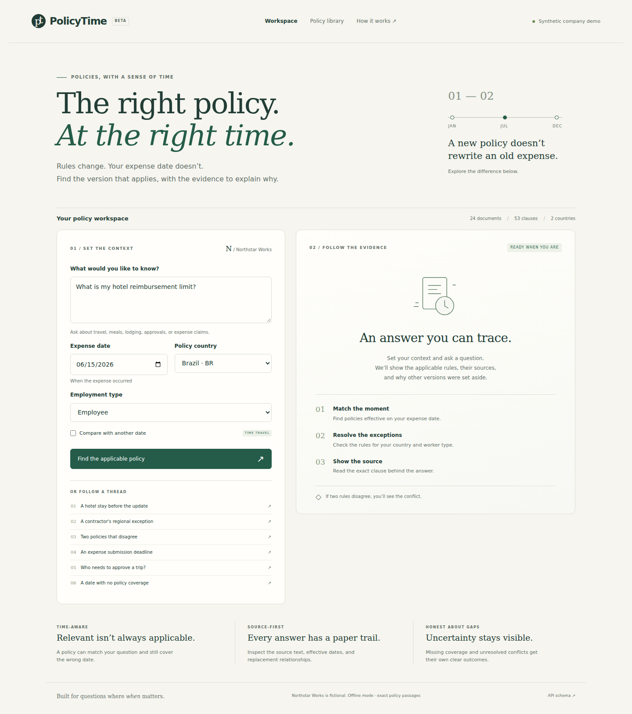
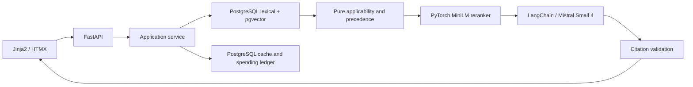

# PolicyTime

**Which policy applied when the expense happened?**

A temporal policy RAG application for a fictional company. Ask about travel expenses, compare dates, inspect exact sources, and see unresolved conflicts instead of an invented answer.

**Status: beta.** Local demo and deployment artifacts are available. Public hosting and hosted-model evaluation are pending credentials. All policies are fictional.



[Two-minute walkthrough](docs/assets/walkthrough.webm) · [Evaluation](docs/evaluation.md) · [Deployment](docs/deployment.md) · [Interview guide](docs/interview-guide.md)

## Try it locally

Requires Python 3.12 and [uv](https://docs.astral.sh/uv/).

```sh
uv sync --locked
uv run policytime validate-corpus
uv run policytime serve --host 127.0.0.1 --port 8000
```

Open http://127.0.0.1:8000. The default demo runs without credentials using lexical retrieval and exact source passages. The interface identifies this mode. The production pipeline uses the models below.

Example: a Brazilian employee's hotel limit is **BRL 180/night on June 15, 2026**, and **BRL 220/night on July 15**. A contractor exception changes the limit while retaining receipt requirements. Two conflicting US meals bulletins produce a `conflict` outcome with both sources.

## What makes this project interesting

- Expense-date, country and employment filtering happens before retrieval ranking.
- Clause-level `supersedes` and `overrides` edges determine precedence. Similarity does not establish authority.
- Immutable domain models represent `answered`, `needs_context`, `conflict` and `no_evidence` separately from operational failures.
- Every answer requires citations; citation IDs and exact quotations are checked against supplied evidence.
- Transactional corpus publication validates references and cycles and assigns a content fingerprint.
- Cache identity includes corpus, context, model and prompt versions. A persistent reservation ledger bounds model spending.

## Architecture



Four layers: `domain` contains pure validated values and decisions; `application` coordinates protocols; `adapters` implement external systems; `delivery` provides HTTP, CLI and templates. See [coding standards](CONTRIBUTING.md).

**Stack:** Python 3.12, FastAPI, Pydantic, SQLAlchemy/Alembic, PostgreSQL/pgvector, PyTorch, sentence-transformers, LangChain, Mistral, Jinja2/HTMX, Docker Compose and GitHub Actions.

Models are pinned in `models.lock.json`: `all-MiniLM-L6-v2` and `ms-marco-MiniLM-L6-v2`. Hosted generation uses `mistral-small-2603`; optional offline judging uses `mistral-large-2512`.

## Run the neural pipeline

```sh
uv sync --locked --extra neural
cp .env.example .env
# Set MISTRAL_API_KEY, a 24+ character POLICYTIME_METRICS_TOKEN,
# and POLICYTIME_MODE=live in .env.
docker compose up -d db
uv run policytime download-models
uv run alembic upgrade head
uv run policytime ingest
uv run policytime serve
```

Never commit `.env` or `deploy/production.env`. For a real-model benchmark without paid generation, keep mode `demo`, configure the database, and use `benchmark --neural` after ingestion.

## Measured results

On 40 held-out synthetic specification cases, real CPU embeddings + PostgreSQL + pure policy decisions + **extractive answers** passed **39/40 (97.5%)** reference checks, with zero fabricated, date/audience-inapplicable or explicitly forbidden citations. These are reference checks, **not human-rated LLM accuracy**.

| Retrieval / decisions | Held-out checks | Sequential p95 |
|---|---:|---:|
| Vector only | 5% | 26.0 ms |
| Filtered hybrid | 77.5% | 18.6 ms |
| Complete | 97.5% | 51.4 ms |
| Complete, reranker off | 97.5% | 18.1 ms |

The reranker added latency without improving these checks. One unrelated parental-leave question incorrectly retrieved lodging evidence. Read the [full report and limitations](docs/evaluation.md), including why the production latency and quality targets remain unverified.

## API

```sh
curl http://127.0.0.1:8000/api/ask -H 'Content-Type: application/json' \
  -d '{"question":"What is the hotel limit?","expense_date":"2026-07-15","country":"BR","employment_type":"employee"}'
```

Read-only endpoints: `/api/policies`, `/api/policies/{id}`, `/api/history/{topic}`. `/healthz` checks liveness; `/readyz` checks readiness. `/metrics` requires a server-side bearer token. Request bodies, concurrency, timeouts and spending are bounded. Visitor questions are excluded from operational logs.

## Validation

```sh
uv sync --locked --extra neural
uv run ruff check .
uv run mypy src
uv run pytest
uv run policytime benchmark --cases evaluation/cases.jsonl --output artifacts/my-run
```

PostgreSQL tests require `POLICYTIME_TEST_DATABASE_URL` pointing to a **disposable migrated database**. Browser tests require `uv run playwright install chromium` and `POLICYTIME_BROWSER_URL` pointing to a running demo. CI supplies both. See [evaluation](docs/evaluation.md) for neural and judge commands.

## Scope and limitations

24 synthetic Markdown documents, 53 clauses, six topics, Brazil/US, employees/contractors. Effective periods are start-inclusive and end-exclusive; the selected date is the expense date. Structured rule values detect conflicts within a shared rule key. Exact quotation validation does not prove the prose is entailed by its sources. Retrieval can answer unrelated questions incorrectly. This is a portfolio demonstration, not an employer policy authority.

No uploads, accounts, reimbursement execution or multi-agent orchestration in v1. Reranker distillation is a separate follow-up experiment against the frozen benchmark. [Four-week delivery checklist](docs/roadmap.md).

MIT licensed. See [third-party notices](THIRD_PARTY_NOTICES.md).
